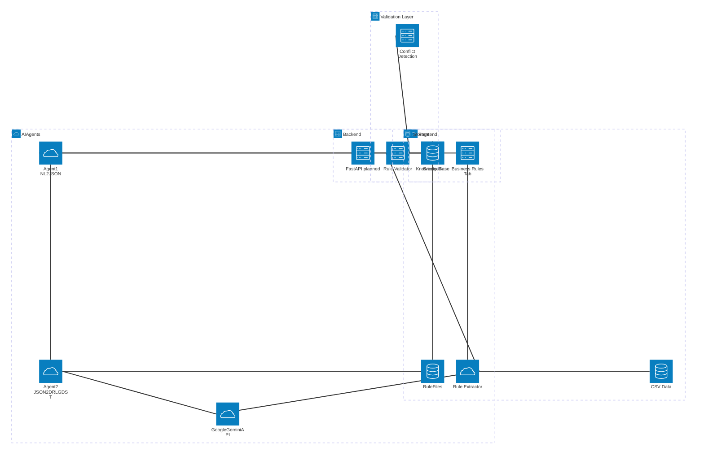

# Architecture Documentation

## System Overview

The Capstone project is an intelligent business rule management platform that empowers non-technical users to create, manage, and deploy business rules using a modern agent-based architecture and LLMs (Google Gemini). The system features a Gradio-based web interface, RAG (Retrieval-Augmented Generation) for context-aware responses, and automated rule file generation (Drools DRL, GDST) with verification and download capabilities.

## Architecture Diagram

## Development Status (May 2025)

### Current Implementation
- **Agent 1**: Converts natural language business rules to structured JSON using Google Gemini (via `google.genai`).
- **Agent 2**: Converts JSON rule output to Drools DRL and GDST files using Google Gen AI (`google.genai`).
- **Agent 3**: Enhanced with conflict detection, impact analysis, and orchestration capabilities.
- **Langraph Workflow Orchestration**: Visual workflow design and transparent execution tracking for LLM tasks.
- **Business Rule Validation**: CSV upload, extraction, conflict detection, and RAG integration system.
- **Rule Extractor**: LLM-powered intelligent conversion from CSV to structured JSON with fallback mechanisms.
- **Conflict Detection**: Validates rules for duplicates and conflicts before integration.
- **RAG Integration**: Extracted rules are automatically added to the knowledge base for searchable queries.
- **Enhanced UI**: New "Business Rules" tab for complete rule management workflow with Langraph visualization.
- **Verification Step**: Placeholder for Drools execution verification after file generation.
- **Gradio UI**: 'Preview & Apply' button triggers Agent 2, generates files, verifies, and provides download links.
- **File Download**: Users can download generated `.drl` and `.gdst` files directly from the interface.
- **Unit Tests**: Agent 2 logic, rule extraction functionality, and Langraph workflows covered by comprehensive tests.
- **UI Updates**: Cleaner interface, workflow toggle, improved status and download components.

### Planned Architecture
- **Backend API**: FastAPI server for orchestration (planned).
- **Enhanced Agent Framework**: ✅ **Completed** - Langraph-based multi-agent orchestration with visual workflow design.
- **Advanced Rule Storage**: Versioned rule management and conflict detection.
- **Frontend Enhancements**: ✅ **Partially Completed** - Added Langraph workflow visualization tab and orchestration toggle.

## Workflow Summary

### Traditional Rule Creation Workflow
1. User enters a business rule in natural language via Gradio chat.
2. Agent 1 (LLM) converts the input to structured JSON.
3. User clicks 'Preview & Apply' to trigger Agent 2.
4. Agent 2 generates Drools DRL and GDST files using Google Gen AI.
5. System verifies the generated files (placeholder step).
6. User downloads the files if verification is successful.

### Business Rule Validation Workflow (New)
1. User uploads CSV file containing business rules via Business Rules tab.
2. Rule Extractor processes CSV using LLM-powered intelligent extraction.
3. System validates extracted rules for format and conflicts.
4. User reviews validation results and resolves any conflicts.
5. Validated rules are integrated into the RAG knowledge base.
6. Rules become searchable and queryable through the chat interface.
7. Users can download processed rules in JSON format.

### Langraph Workflow Orchestration (New)
1. User enables Langraph workflow in the Chat interface toggle.
2. User submits business rule request through chat.
3. Langraph StateGraph orchestrates the following workflow:
   - **Agent 1 Node**: Parses natural language into structured JSON
   - **Agent 3 Conflict Node**: Analyzes conflicts with existing rules
   - **Agent 3 Impact Node**: Assesses rule impact and risks
   - **Agent 3 Orchestration Node**: Makes generation decisions
   - **Agent 2 Node**: Generates DRL and GDST files (conditional)
   - **Verification Node**: Validates generated files
   - **Response Node**: Generates user-facing response
4. Workflow provides transparent execution tracking and error handling.
5. System falls back to traditional Agent 3 workflow on errors.
6. Users can visualize workflow structure in the Langraph Workflow tab.

---
