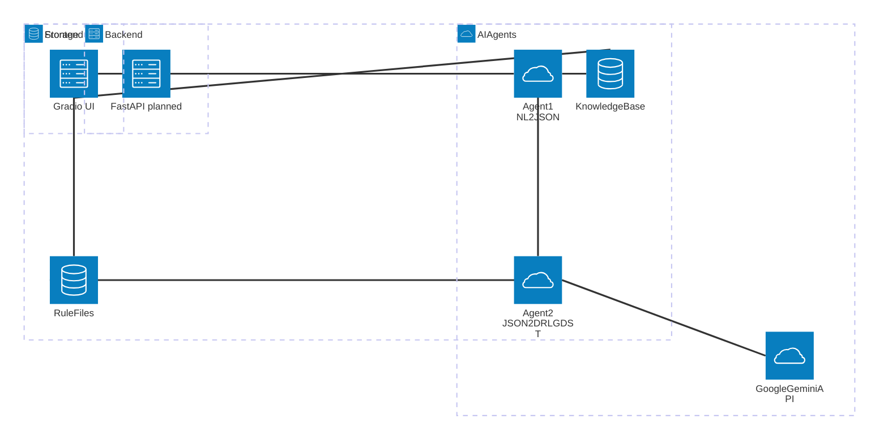

# Architecture Documentation

## System Overview

The Capstone project is an intelligent business rule management platform that empowers non-technical users to create, manage, and deploy business rules using a modern agent-based architecture and LLMs (Google Gemini). The system features a Gradio-based web interface, RAG (Retrieval-Augmented Generation) for context-aware responses, and automated rule file generation (Drools DRL, GDST) with verification and download capabilities.

## Architecture Diagram

## Development Status (May 2025)

### Current Implementation
- **Agent 1**: Converts natural language business rules to structured JSON using Google Gemini (via `google.genai`).
- **Agent 2**: Converts JSON rule output to Drools DRL and GDST files using Google Gen AI (`google.genai`).
- **Verification Step**: Placeholder for Drools execution verification after file generation.
- **Gradio UI**: 'Preview & Apply' button triggers Agent 2, generates files, verifies, and provides download links.
- **File Download**: Users can download generated `.drl` and `.gdst` files directly from the interface.
- **Unit Tests**: Agent 2 logic is covered by unit tests.
- **UI Updates**: Cleaner interface, removed JSON display block, improved status and download components.

### Planned Architecture
- **Backend API**: FastAPI server for orchestration (planned).
- **Enhanced Agent Framework**: Multi-agent orchestration (LangChain, CrewAI, or similar).
- **Advanced Rule Storage**: Versioned rule management and conflict detection.
- **Frontend Enhancements**: More advanced rule management and visualization.

## Workflow Summary
1. User enters a business rule in natural language via Gradio chat.
2. Agent 1 (LLM) converts the input to structured JSON.
3. User clicks 'Preview & Apply' to trigger Agent 2.
4. Agent 2 generates Drools DRL and GDST files using Google Gen AI.
5. System verifies the generated files (placeholder step).
6. User downloads the files if verification is successful.

---
