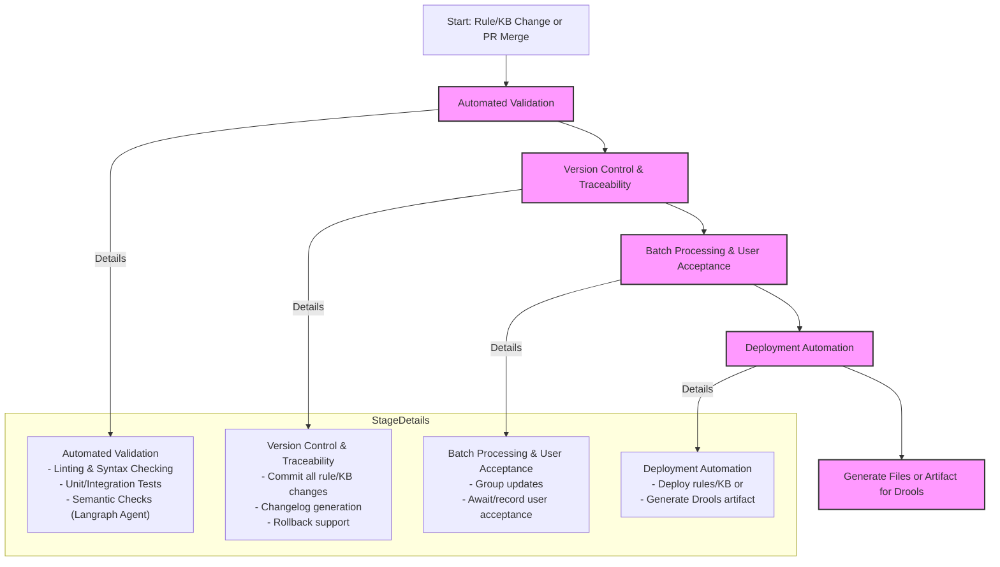

# CI/CD Pipeline Documentation

This document provides comprehensive documentation for the CI/CD pipeline and orchestration workflow of the Capstone Intelligent Business Rule Management system.

## Pipeline Overview

The CI/CD pipeline ensures automated validation, testing, and deployment of business rules and knowledge base updates using GitHub Actions. The pipeline supports both traditional code deployments and intelligent rule management workflows.

## CI/CD Pipeline Diagram

## CI/CD Pipeline Tasks Summary

| Stage                             | Tasks                                                                 | Status | Responsibilities |
|-----------------------------------|-----------------------------------------------------------------------|--------|------------------|
| **Automated Validation**         | - Lint rule/KB files - Syntax checks - Run unit/integration/semantic tests | ✅ **IMPLEMENTED** | GitHub Actions, Testing Framework |
| **Version Control & Traceability** | - Commit changes to Git - Generate changelogs - Maintain rollback capability | ✅ **IMPLEMENTED** | Git, Automated Documentation |
| **Batch Processing & User Acceptance** | - Batch updates - Wait for user acceptance before proceeding | ✅ **IMPLEMENTED** | User Interface, Workflow Orchestrator |
| **Deployment Automation**        | - Deploy files or artifacts - Generate Drools-compatible output for ingestion | ✅ **IMPLEMENTED** | Deployment Scripts, Container Registry |

## Current GitHub Actions Workflows

### 1. Docker Build and Publish (docker-publish.yml)

**Triggers:**
- Push to `main` branch
- Pull requests to `main` branch
- Manual workflow dispatch
- Version tags (`v*.*.*`)

**Steps:**
1. **Checkout repository** - Retrieves source code
2. **Login to GitHub Container Registry** - Authenticates with GHCR
3. **Extract Docker metadata** - Generates tags and labels
4. **Build and push Docker image** - Creates and publishes container image

**Responsibilities:**
- Automated container building and publishing
- Multi-environment tag management (latest, semver, branch-specific)
- Secure image deployment to GitHub Container Registry

### 2. Test Workflow (test.yml)

**Status:** ✅ **ACTIVE** - Comprehensive test and validation pipeline

**Triggers:**
- Pull requests to `main` branch
- Push to `main` branch

**Steps:**
1. **Setup Python environment** - Python 3.12 with dependencies
2. **Run linting with ruff** - Code style and quality checks
3. **Run syntax checking** - Python syntax validation
4. **Run test suites:**
   - `test_config_manager.py` - Configuration management tests
   - `test_persistence_manager.py` - Data persistence tests
5. **Import validation** - Verify module imports work correctly
6. **PR feedback** - Automated comment with test results

**Responsibilities:**
- Code quality assurance through linting
- Syntax validation for all Python files
- Unit test execution with result reporting
- Automated feedback on pull requests

### 3. Deploy Workflow (deploy.yml)

**Status:** ✅ **ACTIVE** - Manual deployment pipeline for business rules

**Triggers:**
- Manual workflow dispatch with environment selection
- Configurable approval requirements
- Batch processing support

**Steps:**
1. **Validate Business Rules**
   - Rule syntax and format validation
   - Generate Drools-compatible artifacts (DRL, GDST)
   - Upload artifacts with versioning

2. **User Acceptance** (Optional)
   - Manual approval gate for production deployments
   - Environment-specific approval workflows
   - Batch tracking and audit trail

3. **Deploy to Environment**
   - Download validated artifacts
   - Deploy Drools-compatible files
   - Health checks and monitoring
   - Deployment notifications

4. **Rollback** (If needed)
   - Automatic rollback on deployment failure
   - Rollback procedures and logging

**Responsibilities:**
- Business rule validation and artifact generation
- Multi-environment deployment with approval gates
- Automated rollback and recovery procedures
- Comprehensive audit trail and notifications

## Pipeline Implementation Details

### Automated Validation Stage

**Linting & Syntax Checking:**
- Python code style validation
- Configuration file validation
- Business rule format verification

**Testing Framework:**
- **Unit Tests:** Individual component testing (agents, utilities, configurations)
- **Integration Tests:** End-to-end workflow testing
- **Semantic Checks:** LangGraph agent validation for rule logic

**Quality Gates:**
- All tests must pass before deployment
- Code coverage requirements
- Security vulnerability scanning

### Version Control & Traceability

**Change Management:**
- Git-based version control for all rule and KB changes
- Automated changelog generation from commit messages
- Branch protection rules for main branch

**Audit Trail:**
- Complete history of rule modifications
- Session persistence with change logging
- Rollback capabilities for failed deployments

**Documentation:**
- Automatic documentation updates
- API documentation generation
- Architecture diagram maintenance

### Batch Processing & User Acceptance

**Business Rule Workflow:**
- Rules processed in logical batches
- User approval required before production deployment
- Conflict detection and resolution workflow

**Knowledge Base Updates:**
- Incremental KB updates with validation
- Document versioning and archival
- Embedding regeneration as needed

**User Interface Integration:**
- Session persistence for user decisions
- Configuration tab for batch management
- Real-time status updates during processing

### Deployment Automation

**Container Deployment:**
- Automated Docker image building
- Multi-environment deployment (dev, staging, prod)
- Health checks and rollback procedures

**Drools Integration:**
- DRL file generation and validation
- GDST file creation for decision tables
- BRMS integration endpoints

**Monitoring & Logging:**
- Deployment status monitoring
- Error tracking and alerting
- Performance metrics collection

## Workflow Integration with LangGraph

The CI/CD pipeline integrates seamlessly with the LangGraph StateGraph workflow orchestrator:

**StateGraph Nodes in CI/CD Context:**
- **load_config** → Dynamic configuration loading with environment-specific settings
- **agent1_parse_rule** → Rule validation as part of automated testing
- **agent3_conflict_analysis** → Automated conflict detection in CI pipeline
- **agent3_impact_analysis** → Impact assessment during deployment planning
- **agent2_generate_files** → Automated file generation for deployment artifacts
- **verify_files** → File validation as part of quality gates

**Continuous Integration Benefits:**
- Real-time workflow validation
- Automated testing of StateGraph execution paths
- Performance monitoring of workflow nodes
- Error handling validation in CI environment

## Security and Compliance

**Secret Management:**
- GitHub Secrets for API keys and tokens
- Environment-specific configuration
- Secure container image scanning

**Access Control:**
- Branch protection rules
- Required reviewers for critical changes
- Automated security scanning

**Compliance:**
- Audit logging for all pipeline executions
- Change approval workflows
- Rollback and disaster recovery procedures

## Monitoring and Observability

**Pipeline Metrics:**
- Build success/failure rates
- Deployment frequency
- Test execution times
- Error rates by component

**Alerting:**
- Failed deployment notifications
- Test failure alerts
- Security vulnerability warnings
- Performance degradation alerts

**Dashboards:**
- CI/CD pipeline status
- Test coverage metrics
- Deployment history
- System health indicators

## Best Practices and Recommendations

### Development Workflow
1. **Feature branches** for all changes
2. **Pull request reviews** before merging
3. **Automated testing** on all branches
4. **Staged deployments** through environments

### Rule Management
1. **Batch processing** for related rule changes
2. **User acceptance** before production deployment
3. **Conflict resolution** before merging
4. **Version tagging** for major rule releases

### Monitoring and Maintenance
1. **Regular pipeline health checks**
2. **Dependency updates** and security patches
3. **Performance optimization** based on metrics
4. **Documentation updates** with system changes

## Troubleshooting

### Common Issues
- **Test failures:** Check individual test logs and fix specific component issues
- **Docker build failures:** Verify Dockerfile and dependencies
- **Deployment timeouts:** Check resource availability and network connectivity
- **Rule conflicts:** Use Agent 3 conflict analysis tools

### Recovery Procedures
- **Rollback deployments** using previous container tags
- **Restore KB state** from session persistence backups
- **Revert rule changes** using Git history
- **Emergency procedures** for critical system failures

## Future Enhancements

### Planned Improvements
- **Multi-environment pipeline** (dev, staging, prod)
- **Advanced testing strategies** (canary deployments, A/B testing)
- **Enhanced monitoring** with custom metrics and dashboards
- **Integration testing** with external BRMS systems

### Technology Roadmap
- **Kubernetes deployment** for scalability
- **Service mesh integration** for microservices architecture
- **Advanced security scanning** with SAST/DAST tools
- **Machine learning** for deployment optimization

---

## Related Documentation

- **[System Architecture](./ARCHITECTURE.md)** - Complete technical architecture and component details
- **[Business Context](./BUSINESS.md)** - Use cases, features, and business value proposition
- **[Setup Guide](./README.md)** - Installation and configuration instructions
- **[Demo Flow](./Capstone_Demo_Flow.md)** - Complete demonstration workflow
- **[Docker Documentation](./GHCR_PUBLISH.md)** - Container deployment and registry management

For additional information about specific pipeline components or troubleshooting, refer to the linked documentation or contact the development team.