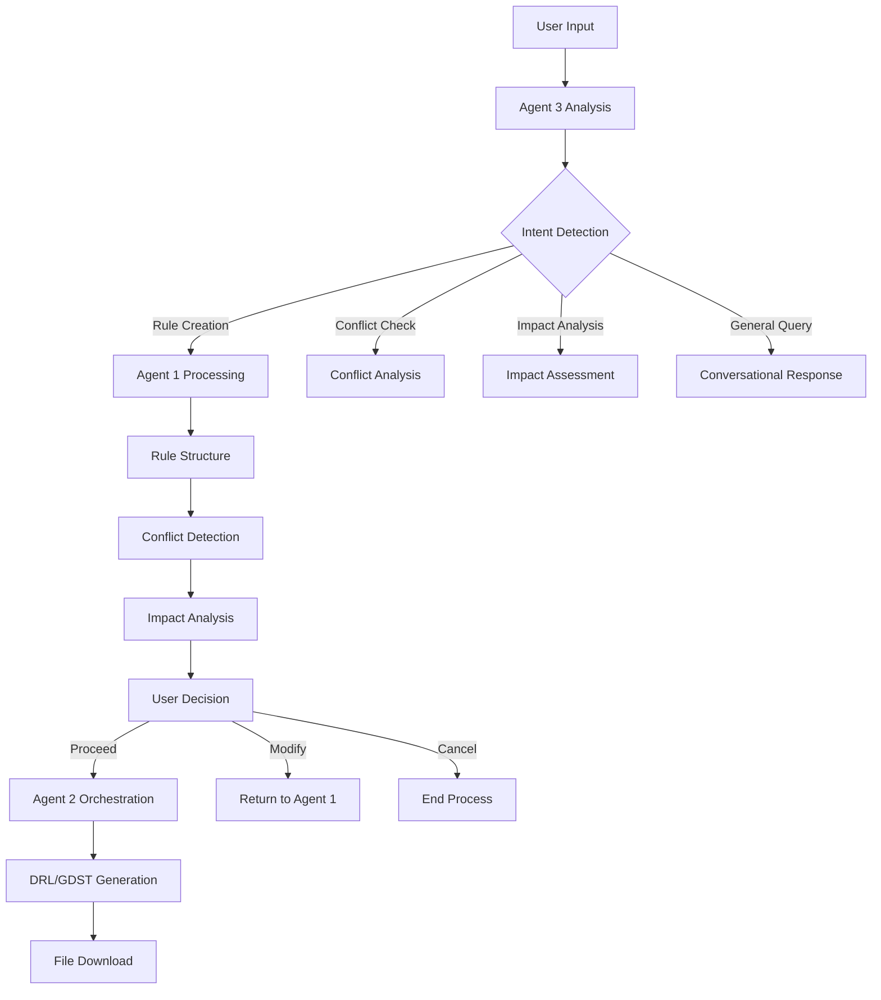

# Agent 3 Documentation - Business Rules Management Assistant

## Overview

Agent 3 is an intelligent business rules management assistant that provides conversational interaction, conflict detection, impact analysis, and orchestration capabilities for business rules across various industries. It serves as the primary interface between users and the rule management system, coordinating with Agent 1 (NL to JSON) and Agent 2 (JSON to DRL/GDST) to provide a comprehensive business rules management solution.

## Key Features

### 1. Conversational Interaction
- **Natural Language Processing**: Understands business rule requests in plain English
- **Context-Aware Responses**: Maintains conversation context and provides relevant responses
- **Industry-Specific Communication**: Adapts communication style based on industry context
- **Multi-Turn Conversations**: Supports complex dialogues for rule refinement

### 2. Conflict Detection
- **Rule Validation**: Automatically detects conflicts between proposed and existing rules
- **Industry-Specific Conflicts**: Identifies conflicts relevant to specific industries
- **Detailed Analysis**: Provides comprehensive explanations of detected conflicts
- **Resolution Recommendations**: Suggests strategies to resolve identified conflicts

### 3. Impact Analysis
- **Operational Impact Assessment**: Evaluates how rule changes affect operations
- **Financial Impact Evaluation**: Assesses cost and revenue implications
- **Risk Assessment**: Identifies potential risks and compliance issues
- **Industry-Specific Metrics**: Uses relevant parameters for each industry

### 4. Orchestration and Decision Support
- **Agent Coordination**: Seamlessly coordinates with Agent 1 and Agent 2
- **Decision Confirmation**: Guides users through decision-making processes
- **Rule Generation Trigger**: Initiates DRL/GDST file generation when appropriate
- **Workflow Management**: Manages the complete rule lifecycle

### 5. Cross-Industry Adaptability
- **Configurable Industry Contexts**: Supports restaurant, retail, manufacturing, healthcare, and generic industries
- **Specialized Parameters**: Uses industry-specific parameters for analysis
- **Flexible Framework**: Easy to extend for additional industries
- **Adaptive Prompting**: Adjusts communication based on industry requirements

## Technical Architecture

### Core Components

1. **Agent3Utils Module** (`utils/agent3_utils.py`)
   - `analyze_rule_conflicts()`: Enhanced conflict detection with industry context
   - `assess_rule_impact()`: Comprehensive impact analysis
   - `generate_conversational_response()`: Context-aware response generation
   - `orchestrate_rule_generation()`: Workflow orchestration

2. **Industry Configuration** (`config/agent_config.py`)
   - `INDUSTRY_CONFIGS`: Industry-specific parameters and settings
   - `AGENT3_PROMPT`: Core prompt for Agent 3 behavior
   - `AGENT3_GENERATION_CONFIG`: LLM configuration for Agent 3

3. **UI Integration** (`interface/chat_app.py`)
   - Enhanced chat interface with Agent 3 capabilities
   - Industry selection and mode configuration
   - Decision support components

### Data Flow



## Usage Guide

### Basic Usage

1. **Start a Conversation**
   ```
   User: "Create a rule for 10% discount on orders over $100"
   Agent 3: I've analyzed your request and created a discount rule. Let me check for conflicts...
   ```

2. **Check for Conflicts**
   ```
   User: "Are there any conflicts with my new pricing rule?"
   Agent 3: I've found no conflicts with existing rules. Here's the impact analysis...
   ```

3. **Analyze Impact**
   ```
   User: "What's the impact of changing our employee scheduling rule?"
   Agent 3: Based on your restaurant context, here are the potential impacts...
   ```

### Industry-Specific Usage

#### Restaurant Industry
```python
# Example conversation flow
user_query = "Create a rule for weekend shift scheduling with 20% premium pay"
response = chat_with_agent3(user_query, [], knowledge_base, "restaurant")
# Agent 3 considers: staffing levels, operating hours, peak times, labor costs
```

#### Retail Industry
```python
# Example conversation flow
user_query = "Add a rule for seasonal pricing adjustments"
response = chat_with_agent3(user_query, [], knowledge_base, "retail")
# Agent 3 considers: inventory levels, seasonal demand, pricing strategy
```

### Advanced Features

#### Conflict Resolution Workflow
1. **Detection**: Agent 3 identifies potential conflicts
2. **Analysis**: Provides detailed explanation of conflicts
3. **Recommendations**: Suggests resolution strategies
4. **User Decision**: Guides user through options
5. **Implementation**: Coordinates rule updates

#### Impact Analysis Workflow
1. **Rule Assessment**: Evaluates proposed rule changes
2. **Context Analysis**: Considers industry-specific factors
3. **Risk Evaluation**: Identifies potential risks and benefits
4. **Recommendation**: Provides implementation guidance

## Configuration

### Industry Settings

```python
INDUSTRY_CONFIGS = {
    "restaurant": {
        "key_parameters": ["staffing_levels", "operating_hours", "peak_times", "food_safety"],
        "common_conflicts": ["scheduling_overlap", "resource_allocation"],
        "impact_areas": ["customer_service", "cost_efficiency", "staff_satisfaction"]
    },
    # ... other industries
}
```

### Agent 3 Prompt Configuration

```python
AGENT3_PROMPT = """
You are Agent 3, an intelligent business rules management assistant...
[Detailed prompt configuration for behavior and capabilities]
"""
```

## API Reference

### Core Functions

#### `analyze_rule_conflicts(proposed_rule, existing_rules, industry)`
Analyzes conflicts between proposed and existing rules with industry context.

**Parameters:**
- `proposed_rule` (Dict): The new rule being proposed
- `existing_rules` (List[Dict]): Existing rules in the system
- `industry` (str): Industry context (restaurant, retail, etc.)

**Returns:**
- `Tuple[List[Dict], str]`: Conflicts list and detailed analysis

#### `assess_rule_impact(proposed_rule, existing_rules, industry)`
Evaluates the operational and business impact of rule modifications.

**Parameters:**
- `proposed_rule` (Dict): The rule being analyzed
- `existing_rules` (List[Dict]): Existing rules for context
- `industry` (str): Industry context

**Returns:**
- `Dict[str, Any]`: Impact analysis results

#### `generate_conversational_response(user_query, context, rag_df, industry)`
Generates context-aware conversational responses.

**Parameters:**
- `user_query` (str): User's question or request
- `context` (Dict): Current context including rules, conflicts, etc.
- `rag_df` (pd.DataFrame): RAG knowledge base
- `industry` (str): Industry context

**Returns:**
- `str`: Conversational response from Agent 3

#### `orchestrate_rule_generation(user_decision, proposed_rule, conflicts)`
Orchestrates the rule generation process after user confirmation.

**Parameters:**
- `user_decision` (str): User's decision (proceed, modify, cancel)
- `proposed_rule` (Dict): The rule to be processed
- `conflicts` (List[Dict]): Any identified conflicts

**Returns:**
- `Tuple[bool, str, Optional[str]]`: Should proceed, status message, orchestration result

## Integration Examples

### With Existing Agents

```python
# Complete workflow example
def complete_rule_workflow(user_input, knowledge_base, industry="restaurant"):
    # Step 1: Agent 3 processes user input
    response = chat_with_agent3(user_input, [], knowledge_base, industry)
    
    # Step 2: If rule creation detected, analyze conflicts
    if rule_response:
        conflicts, analysis = analyze_rule_conflicts(
            rule_response, existing_rules, industry
        )
        
        # Step 3: Assess impact
        impact = assess_rule_impact(rule_response, existing_rules, industry)
        
        # Step 4: User decision and orchestration
        decision = get_user_decision()
        should_proceed, status, result = orchestrate_rule_generation(
            decision, rule_response, conflicts
        )
        
        # Step 5: Generate files if approved
        if should_proceed:
            # Trigger Agent 2 for DRL/GDST generation
            pass
    
    return response
```

### With Gradio UI

```python
# Enhanced chat interface
def chat_and_update_agent3(user_input, history, rag_state_df, mode, industry):
    if mode == "Enhanced Agent 3":
        response = chat_with_agent3(user_input, history, rag_state_df, industry)
    else:
        response = chat_with_rag(user_input, history, rag_state_df)
    
    return response, name, summary, rag_state_df
```

## Best Practices

### 1. Industry Configuration
- **Customize Parameters**: Tailor industry configs to specific business needs
- **Regular Updates**: Keep industry parameters current with business changes
- **Validation Testing**: Test with industry-specific scenarios

### 2. Conflict Detection
- **Comprehensive Rules**: Ensure all existing rules are in the knowledge base
- **Regular Validation**: Periodically check for new conflict patterns
- **User Training**: Educate users on common conflict scenarios

### 3. Impact Analysis
- **Business Context**: Include relevant business metrics and KPIs
- **Risk Assessment**: Consider both positive and negative impacts
- **Stakeholder Input**: Involve relevant stakeholders in impact evaluation

### 4. User Experience
- **Clear Communication**: Use plain language for explanations
- **Progressive Disclosure**: Reveal complexity gradually
- **Decision Support**: Provide clear options and recommendations

## Troubleshooting

### Common Issues

1. **API Key Errors**
   ```
   Error: Google API key not found
   Solution: Ensure GOOGLE_API_KEY is set in environment variables
   ```

2. **Empty Knowledge Base**
   ```
   Issue: No RAG context available
   Solution: Upload documents and build knowledge base first
   ```

3. **Industry Configuration**
   ```
   Issue: Industry not recognized
   Solution: Check INDUSTRY_CONFIGS for supported industries
   ```

### Performance Optimization

1. **Response Times**: Cache frequently used analyses
2. **Resource Usage**: Optimize prompts for efficiency
3. **Scaling**: Consider rate limiting for high-volume usage

## Future Enhancements

### Planned Features
1. **Advanced ML Models**: Integration with specialized rule conflict detection models
2. **Real-time Monitoring**: Live monitoring of rule performance and impact
3. **A/B Testing**: Built-in support for rule A/B testing
4. **Integration APIs**: REST endpoints for external system integration
5. **Advanced Analytics**: Comprehensive rule usage and performance analytics

### Roadmap
- **Phase 1**: Enhanced conflict detection algorithms
- **Phase 2**: Real-time impact monitoring
- **Phase 3**: Predictive rule recommendations
- **Phase 4**: Multi-tenant enterprise features

---

*Last updated: January 2025*
*Version: 1.0*
*Agent 3 Implementation for Business Rules Management*