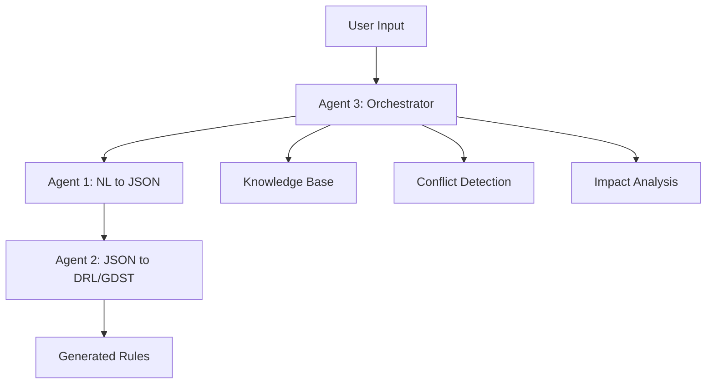

# Agent System - Deep Dive Documentation

## 📋 Overview

The Agent System implements a sophisticated three-agent architecture for comprehensive business rules management. Each agent specializes in specific aspects of rule processing, from natural language understanding to executable rule generation, with Agent 3 serving as an intelligent orchestrator and conversational interface.

## 🏗️ Agent Architecture

### Three-Agent System Design



### Agent Responsibilities

**Agent 1: Natural Language to JSON**
- Convert natural language business requirements to structured JSON
- Industry-specific understanding and context adaptation
- Complex rule logic interpretation

**Agent 2: JSON to DRL/GDST**  
- Generate executable Drools Rule Language (DRL) files
- Create Guided Decision Tables (GDST) for business users
- Optimize rule execution and validate syntax

**Agent 3: Business Rules Management Assistant**
- Orchestrate the entire rule management workflow
- Provide conversational interface for rule interaction
- Perform conflict detection and impact analysis
- Manage rule lifecycle and version control

## 🤖 Agent 1: Natural Language to JSON Converter

### Core Functionality

**Purpose**: Transform business requirements expressed in natural language into structured JSON rule representations.

**Key Features**:
- Industry-specific vocabulary and context understanding
- Complex condition parsing and logic extraction
- Multi-turn conversation support for rule refinement
- Ambiguity resolution through clarifying questions

### Implementation

**Agent Configuration:**
```python
AGENT1_PROMPT = """
You are Agent 1, specialized in converting natural language business rules into structured JSON format.

Your responsibilities:
1. Parse natural language rule descriptions
2. Extract conditions, actions, and metadata
3. Handle industry-specific terminology
4. Ask clarifying questions when ambiguous
5. Ensure JSON structure compliance

Industry Context: {industry}
Available Fields: {available_fields}
"""

AGENT1_GENERATION_CONFIG = {
    "temperature": 0.3,  # Lower temperature for more consistent JSON output
    "top_p": 0.8,
    "top_k": 40,
    "max_output_tokens": 2048,
    "response_mime_type": "application/json"
}
```

**Processing Workflow:**
```python
def agent1_process(user_input: str, industry_context: str = "generic") -> Dict:
    """Process natural language input through Agent 1"""
    
    # Prepare context-aware prompt
    prompt = prepare_agent1_prompt(user_input, industry_context)
    
    # Generate structured JSON response
    response = gemini_client.models.generate_content(
        model=DEFAULT_MODEL,
        contents=prompt,
        config=AGENT1_GENERATION_CONFIG
    )
    
    # Validate and clean JSON output
    json_rule = validate_and_clean_json(response.text)
    
    # Add metadata and versioning information
    json_rule = enrich_with_metadata(json_rule, industry_context)
    
    return json_rule
```

### Industry-Specific Processing

**Restaurant Industry Example:**
```python
RESTAURANT_CONTEXT = {
    "common_conditions": [
        "table_size", "meal_type", "time_of_day", "day_of_week",
        "customer_type", "reservation_type", "special_dietary_needs"
    ],
    "common_actions": [
        "apply_discount", "recommend_wine", "suggest_appetizer",
        "allocate_table", "notify_kitchen", "update_wait_time"
    ],
    "business_metrics": [
        "revenue_impact", "customer_satisfaction", "table_turnover",
        "kitchen_efficiency", "staff_workload"
    ]
}

def process_restaurant_rule(user_input: str) -> Dict:
    """Process restaurant-specific rule"""
    enhanced_prompt = f"""
    {AGENT1_PROMPT}
    
    Restaurant-specific context:
    - Table management and seating optimization
    - Menu recommendations and dietary restrictions
    - Kitchen capacity and timing considerations
    - Customer experience and satisfaction metrics
    
    User Input: {user_input}
    """
    
    return agent1_process(enhanced_prompt, "restaurant")
```

**Output Example:**
```json
{
  "rule_id": "REST_001",
  "name": "VIP Customer Priority Seating",
  "industry": "restaurant",
  "conditions": [
    "customer.type == 'VIP'",
    "reservation.party_size <= 4",
    "time_of_day.between('18:00', '21:00')"
  ],
  "actions": [
    "assign_premium_table()",
    "notify_manager()",
    "offer_complimentary_appetizer()",
    "reduce_wait_time(priority='high')"
  ],
  "metadata": {
    "priority": 1,
    "estimated_impact": "medium",
    "business_value": "customer_retention"
  }
}
```

## 🔧 Agent 2: JSON to DRL/GDST Generator

### Core Functionality

**Purpose**: Convert structured JSON rules into executable formats (DRL and GDST) for business rule engines.

**Key Features**:
- Drools Rule Language (DRL) file generation
- Guided Decision Table (GDST) creation for business users
- Syntax validation and optimization
- Rule execution testing and verification

### Implementation

**Agent Configuration:**
```python
AGENT2_PROMPT = """
You are Agent 2, specialized in converting JSON business rules into executable DRL and GDST formats.

Your responsibilities:
1. Generate syntactically correct DRL files
2. Create user-friendly GDST decision tables
3. Optimize rule execution performance
4. Ensure proper Drools syntax compliance
5. Add appropriate rule metadata and documentation

Input JSON Rule: {json_rule}
Target Format: {target_format}
Industry Context: {industry}
"""

AGENT2_GENERATION_CONFIG = {
    "temperature": 0.2,  # Very low temperature for syntax accuracy
    "top_p": 0.7,
    "top_k": 30,
    "max_output_tokens": 3072
}
```

**DRL Generation:**
```python
def generate_drl_content(json_rule: Dict, industry_context: str = "generic") -> str:
    """Generate Drools Rule Language content from JSON rule"""
    
    rule_name = json_rule.get('name', 'UnnamedRule')
    rule_id = json_rule.get('rule_id', 'UNKNOWN')
    conditions = json_rule.get('conditions', [])
    actions = json_rule.get('actions', [])
    
    # Build DRL content with proper syntax
    drl_content = f"""
package com.businessrules.{industry_context};

import com.businessrules.facts.*;
import com.businessrules.actions.*;

rule "{rule_name} - {rule_id}"
    agenda-group "{industry_context}"
    salience {json_rule.get('priority', 0)}
    when
{format_drl_conditions(conditions)}
    then
{format_drl_actions(actions)}
end
"""
    
    return drl_content.strip()

def format_drl_conditions(conditions: List[str]) -> str:
    """Format conditions for DRL syntax"""
    formatted_conditions = []
    
    for condition in conditions:
        # Convert JSON-style conditions to DRL syntax
        drl_condition = convert_to_drl_syntax(condition)
        formatted_conditions.append(f"        {drl_condition}")
    
    return "\n".join(formatted_conditions)

def format_drl_actions(actions: List[str]) -> str:
    """Format actions for DRL syntax"""
    formatted_actions = []
    
    for action in actions:
        # Convert JSON-style actions to DRL syntax
        drl_action = convert_action_to_drl(action)
        formatted_actions.append(f"        {drl_action};")
    
    return "\n".join(formatted_actions)
```

**GDST Generation:**
```python
def generate_gdst_content(json_rule: Dict) -> str:
    """Generate Guided Decision Table content"""
    
    conditions = json_rule.get('conditions', [])
    actions = json_rule.get('actions', [])
    
    # Create decision table structure
    gdst_content = f"""
<decision-table>
    <table-name>{json_rule.get('name', 'Decision Table')}</table-name>
    <rule-id>{json_rule.get('rule_id', 'UNKNOWN')}</rule-id>
    
    <condition-columns>
{format_gdst_conditions(conditions)}
    </condition-columns>
    
    <action-columns>
{format_gdst_actions(actions)}
    </action-columns>
    
    <data-rows>
        <row>
{format_gdst_data_row(json_rule)}
        </row>
    </data-rows>
</decision-table>
"""
    
    return gdst_content.strip()
```

### Rule Optimization

**Performance Optimization:**
```python
def optimize_rule_performance(drl_content: str) -> str:
    """Optimize DRL rules for better performance"""
    
    optimizations = [
        # Move most selective conditions first
        reorder_conditions_by_selectivity,
        
        # Combine similar conditions
        combine_redundant_conditions,
        
        # Optimize fact patterns
        optimize_fact_patterns,
        
        # Add appropriate agenda groups
        add_agenda_groups
    ]
    
    optimized_content = drl_content
    for optimization in optimizations:
        optimized_content = optimization(optimized_content)
    
    return optimized_content

def verify_drools_execution(drl_content: str) -> VerificationResult:
    """Verify DRL syntax and execution"""
    try:
        # Parse DRL content
        parsed_rules = parse_drl_syntax(drl_content)
        
        # Validate rule structure
        validation_errors = validate_rule_structure(parsed_rules)
        
        # Test rule execution with sample facts
        execution_result = test_rule_execution(drl_content)
        
        return VerificationResult(
            is_valid=len(validation_errors) == 0,
            syntax_errors=validation_errors,
            execution_successful=execution_result.success,
            performance_metrics=execution_result.metrics
        )
        
    except Exception as e:
        return VerificationResult(
            is_valid=False,
            syntax_errors=[str(e)],
            execution_successful=False
        )
```

## 🎯 Agent 3: Business Rules Management Assistant

### Core Functionality

**Purpose**: Orchestrate the entire rule management workflow and provide intelligent conversational interface.

**Key Features**:
- Conversational rule management interface
- Conflict detection and resolution
- Impact analysis and risk assessment
- Rule lifecycle orchestration
- Multi-turn dialogue support

### Implementation

**Agent Configuration:**
```python
AGENT3_PROMPT = """
You are Agent 3, an intelligent business rules management assistant with expertise in:

1. CONVERSATIONAL INTERACTION
   - Natural language understanding for rule management
   - Context-aware responses and recommendations
   - Multi-turn conversation support

2. CONFLICT DETECTION & ANALYSIS
   - Identify conflicts between proposed and existing rules
   - Analyze rule interactions and dependencies
   - Provide resolution strategies

3. IMPACT ANALYSIS
   - Assess operational and financial impact of rule changes
   - Evaluate risk levels and compliance implications
   - Generate recommendations for rule modifications

4. WORKFLOW ORCHESTRATION
   - Coordinate Agent 1 and Agent 2 operations
   - Manage rule lifecycle and version control
   - Guide users through rule creation and modification

Industry Context: {industry}
Conversation History: {conversation_history}
Available Rules: {existing_rules}
"""

AGENT3_GENERATION_CONFIG = {
    "temperature": 0.4,  # Balanced for conversational and analytical tasks
    "top_p": 0.9,
    "top_k": 50,
    "max_output_tokens": 2048
}
```

### Conversational Interface

**Multi-Turn Conversation Management:**
```python
class ConversationManager:
    """Manage multi-turn conversations with Agent 3"""
    
    def __init__(self):
        self.conversation_history = []
        self.context = {}
        
    def process_user_input(self, user_input: str, industry: str = "generic") -> str:
        """Process user input and generate contextual response"""
        
        # Add user input to conversation history
        self.conversation_history.append({
            "role": "user",
            "content": user_input,
            "timestamp": datetime.now().isoformat()
        })
        
        # Analyze user intent
        intent = self.analyze_user_intent(user_input)
        
        # Generate contextual response based on intent
        if intent == "create_rule":
            response = self.handle_rule_creation(user_input, industry)
        elif intent == "modify_rule":
            response = self.handle_rule_modification(user_input, industry)
        elif intent == "analyze_conflicts":
            response = self.handle_conflict_analysis(user_input, industry)
        elif intent == "impact_analysis":
            response = self.handle_impact_analysis(user_input, industry)
        else:
            response = self.generate_general_response(user_input, industry)
        
        # Add response to conversation history
        self.conversation_history.append({
            "role": "assistant",
            "content": response,
            "timestamp": datetime.now().isoformat()
        })
        
        return response
    
    def analyze_user_intent(self, user_input: str) -> str:
        """Analyze user intent from input"""
        intent_keywords = {
            "create_rule": ["create", "new rule", "add rule", "make rule"],
            "modify_rule": ["modify", "change", "update", "edit"],
            "analyze_conflicts": ["conflicts", "check conflicts", "validate"],
            "impact_analysis": ["impact", "analyze impact", "what if", "effect"]
        }
        
        user_input_lower = user_input.lower()
        
        for intent, keywords in intent_keywords.items():
            if any(keyword in user_input_lower for keyword in keywords):
                return intent
        
        return "general_inquiry"
```

### Conflict Detection System

**Advanced Conflict Analysis:**
```python
def analyze_rule_conflicts(new_rule: Dict, existing_rules: List[Dict], 
                          industry_context: str = "generic") -> Dict:
    """Comprehensive conflict analysis with industry context"""
    
    conflicts = []
    
    # Initialize industry-specific conflict detector
    conflict_detector = ConflictDetectorFactory.get_detector(industry_context)
    
    for existing_rule in existing_rules:
        # Detect different types of conflicts
        logical_conflicts = conflict_detector.detect_logical_conflicts(new_rule, existing_rule)
        business_conflicts = conflict_detector.detect_business_conflicts(new_rule, existing_rule)
        operational_conflicts = conflict_detector.detect_operational_conflicts(new_rule, existing_rule)
        
        # Combine all detected conflicts
        rule_conflicts = logical_conflicts + business_conflicts + operational_conflicts
        
        if rule_conflicts:
            conflicts.extend([
                {
                    "conflicting_rule": existing_rule['rule_id'],
                    "conflict_type": conflict.type,
                    "severity": conflict.severity,
                    "description": conflict.description,
                    "resolution_suggestions": conflict.resolutions
                }
                for conflict in rule_conflicts
            ])
    
    return {
        "has_conflicts": len(conflicts) > 0,
        "conflict_count": len(conflicts),
        "conflicts": conflicts,
        "overall_risk_level": calculate_overall_risk(conflicts),
        "recommended_actions": generate_conflict_recommendations(conflicts)
    }

class RestaurantConflictDetector:
    """Restaurant-specific conflict detection"""
    
    def detect_logical_conflicts(self, rule1: Dict, rule2: Dict) -> List[Conflict]:
        """Detect restaurant-specific logical conflicts"""
        conflicts = []
        
        # Check for contradictory seating rules
        if self.has_contradictory_seating_logic(rule1, rule2):
            conflicts.append(Conflict(
                type="seating_logic_conflict",
                severity="high",
                description="Rules have contradictory seating assignment logic",
                resolutions=["Modify seating conditions", "Add priority hierarchy"]
            ))
        
        # Check for conflicting kitchen capacity rules
        if self.has_kitchen_capacity_conflicts(rule1, rule2):
            conflicts.append(Conflict(
                type="kitchen_capacity_conflict",
                severity="medium",
                description="Rules may exceed kitchen capacity during peak hours",
                resolutions=["Add capacity checks", "Implement queue management"]
            ))
        
        return conflicts
    
    def detect_business_conflicts(self, rule1: Dict, rule2: Dict) -> List[Conflict]:
        """Detect business logic conflicts"""
        conflicts = []
        
        # Check for pricing conflicts
        if self.has_pricing_conflicts(rule1, rule2):
            conflicts.append(Conflict(
                type="pricing_conflict",
                severity="high",
                description="Rules create conflicting pricing for same items",
                resolutions=["Consolidate pricing rules", "Add precedence logic"]
            ))
        
        return conflicts
```

### Impact Analysis System

**Comprehensive Impact Assessment:**
```python
def assess_rule_impact(rule_data: Dict, modification_type: str = "create",
                      industry_context: str = "generic") -> Dict:
    """Assess comprehensive impact of rule changes"""
    
    impact_analyzer = ImpactAnalyzerFactory.get_analyzer(industry_context)
    
    # Analyze different impact dimensions
    operational_impact = impact_analyzer.analyze_operational_impact(rule_data)
    financial_impact = impact_analyzer.analyze_financial_impact(rule_data)
    customer_impact = impact_analyzer.analyze_customer_impact(rule_data)
    compliance_impact = impact_analyzer.analyze_compliance_impact(rule_data)
    
    # Calculate overall impact score
    overall_impact = calculate_weighted_impact_score([
        operational_impact,
        financial_impact,
        customer_impact,
        compliance_impact
    ])
    
    return {
        "overall_impact_level": overall_impact.level,
        "confidence_score": overall_impact.confidence,
        "impact_dimensions": {
            "operational": operational_impact,
            "financial": financial_impact,
            "customer": customer_impact,
            "compliance": compliance_impact
        },
        "recommendations": generate_impact_recommendations(overall_impact),
        "monitoring_requirements": suggest_monitoring_requirements(rule_data),
        "rollback_plan": create_rollback_plan(rule_data, modification_type)
    }

class RestaurantImpactAnalyzer:
    """Restaurant-specific impact analysis"""
    
    def analyze_operational_impact(self, rule_data: Dict) -> ImpactAssessment:
        """Analyze operational impact for restaurant"""
        
        factors = []
        
        # Kitchen workflow impact
        if self.affects_kitchen_workflow(rule_data):
            factors.append(ImpactFactor(
                category="kitchen_workflow",
                impact_level="medium",
                description="Rule affects kitchen order processing",
                mitigation="Staff training and kitchen system updates required"
            ))
        
        # Table turnover impact
        if self.affects_table_turnover(rule_data):
            factors.append(ImpactFactor(
                category="table_turnover",
                impact_level="high",
                description="Rule may impact table turnover rates",
                mitigation="Monitor seating efficiency and adjust as needed"
            ))
        
        # Staff workload impact
        if self.affects_staff_workload(rule_data):
            factors.append(ImpactFactor(
                category="staff_workload",
                impact_level="low",
                description="Minimal impact on staff procedures",
                mitigation="Brief staff on new procedures"
            ))
        
        return ImpactAssessment(
            category="operational",
            overall_level=calculate_max_impact_level(factors),
            factors=factors,
            confidence=0.85
        )
```

### Orchestration Workflow

**Rule Generation Orchestration:**
```python
def orchestrate_rule_generation(user_input: str, industry_context: str = "generic",
                               conversation_history: List[Dict] = None) -> Dict:
    """Orchestrate complete rule generation workflow"""
    
    workflow_result = {
        "success": False,
        "steps_completed": [],
        "generated_content": {},
        "recommendations": [],
        "next_actions": []
    }
    
    try:
        # Step 1: Agent 3 analyzes user input and determines approach
        analysis = analyze_user_request(user_input, industry_context, conversation_history)
        workflow_result["steps_completed"].append("user_request_analysis")
        
        if analysis["requires_clarification"]:
            return {
                "success": True,
                "needs_clarification": True,
                "clarification_questions": analysis["questions"],
                "partial_understanding": analysis["understood_elements"]
            }
        
        # Step 2: Agent 1 converts natural language to JSON
        json_rule = agent1_process(user_input, industry_context)
        workflow_result["steps_completed"].append("nl_to_json_conversion")
        workflow_result["generated_content"]["json_rule"] = json_rule
        
        # Step 3: Agent 3 performs conflict detection
        existing_rules = load_existing_rules(industry_context)
        conflict_analysis = analyze_rule_conflicts(json_rule, existing_rules, industry_context)
        workflow_result["steps_completed"].append("conflict_analysis")
        workflow_result["generated_content"]["conflict_analysis"] = conflict_analysis
        
        if conflict_analysis["has_conflicts"]:
            high_severity_conflicts = [
                c for c in conflict_analysis["conflicts"] 
                if c["severity"] == "high"
            ]
            
            if high_severity_conflicts:
                return {
                    "success": True,
                    "requires_resolution": True,
                    "conflicts": conflict_analysis,
                    "suggested_resolutions": conflict_analysis["recommended_actions"]
                }
        
        # Step 4: Agent 3 performs impact analysis
        impact_analysis = assess_rule_impact(json_rule, "create", industry_context)
        workflow_result["steps_completed"].append("impact_analysis")
        workflow_result["generated_content"]["impact_analysis"] = impact_analysis
        
        # Step 5: Agent 2 generates DRL and GDST files
        drl_content, gdst_content = json_to_drl_gdst(json_rule, industry_context, update_version_info=True)
        workflow_result["steps_completed"].append("drl_gdst_generation")
        workflow_result["generated_content"]["drl_content"] = drl_content
        workflow_result["generated_content"]["gdst_content"] = gdst_content
        
        # Step 6: Agent 3 provides final recommendations
        recommendations = generate_final_recommendations(
            json_rule, conflict_analysis, impact_analysis
        )
        workflow_result["recommendations"] = recommendations
        workflow_result["next_actions"] = suggest_next_actions(impact_analysis)
        
        workflow_result["success"] = True
        
    except Exception as e:
        logger.error(f"Orchestration workflow failed: {e}")
        workflow_result["error"] = str(e)
        workflow_result["fallback_available"] = True
    
    return workflow_result
```

## 🧪 Agent Testing & Quality Assurance

### Agent-Specific Testing

**Agent 1 Testing:**
```python
def test_agent1_json_conversion():
    """Test Agent 1 natural language to JSON conversion"""
    
    test_cases = [
        {
            "input": "Create a rule for VIP customers to get 15% discount",
            "expected_fields": ["rule_id", "name", "conditions", "actions"],
            "industry": "retail"
        },
        {
            "input": "Large tables of 8+ people should get priority seating during dinner",
            "expected_conditions": ["table_size >= 8", "meal_type == 'dinner'"],
            "industry": "restaurant"
        }
    ]
    
    for test_case in test_cases:
        result = agent1_process(test_case["input"], test_case["industry"])
        
        # Validate JSON structure
        assert isinstance(result, dict)
        
        # Check required fields
        if "expected_fields" in test_case:
            for field in test_case["expected_fields"]:
                assert field in result
        
        # Validate specific conditions
        if "expected_conditions" in test_case:
            conditions = result.get("conditions", [])
            for expected_condition in test_case["expected_conditions"]:
                assert any(expected_condition in condition for condition in conditions)

def test_agent2_drl_generation():
    """Test Agent 2 DRL generation"""
    
    sample_json_rule = {
        "rule_id": "TEST_001",
        "name": "Test Discount Rule",
        "conditions": ["customer.type == 'VIP'", "order.amount > 100"],
        "actions": ["applyDiscount(order, 0.15)", "logActivity('VIP discount applied')"]
    }
    
    drl_content, gdst_content = json_to_drl_gdst(sample_json_rule)
    
    # Validate DRL syntax
    assert "rule " in drl_content
    assert "when" in drl_content
    assert "then" in drl_content
    assert "end" in drl_content
    
    # Validate GDST structure
    assert "<decision-table>" in gdst_content
    assert "<condition-columns>" in gdst_content
    assert "<action-columns>" in gdst_content
    
    # Test syntax validation
    validation_result = verify_drools_execution(drl_content)
    assert validation_result.is_valid

def test_agent3_orchestration():
    """Test Agent 3 orchestration workflow"""
    
    test_input = "I need a rule for restaurant VIP customers"
    result = orchestrate_rule_generation(test_input, "restaurant")
    
    # Validate orchestration success
    assert result["success"]
    
    # Check workflow completion
    expected_steps = [
        "user_request_analysis",
        "nl_to_json_conversion", 
        "conflict_analysis",
        "impact_analysis",
        "drl_gdst_generation"
    ]
    
    for step in expected_steps:
        assert step in result["steps_completed"]
    
    # Validate generated content
    assert "json_rule" in result["generated_content"]
    assert "drl_content" in result["generated_content"]
    assert "impact_analysis" in result["generated_content"]
```

### Integration Testing

**End-to-End Agent Flow Testing:**
```python
def test_complete_agent_workflow():
    """Test complete three-agent workflow"""
    
    # Test restaurant rule creation
    user_input = "Create a rule that gives VIP customers priority seating and complimentary appetizers during dinner hours"
    
    # Step 1: Agent 3 initial processing
    conversation_manager = ConversationManager()
    initial_response = conversation_manager.process_user_input(user_input, "restaurant")
    
    # Step 2: Full orchestration
    orchestration_result = orchestrate_rule_generation(user_input, "restaurant")
    
    assert orchestration_result["success"]
    
    # Step 3: Validate generated rule
    json_rule = orchestration_result["generated_content"]["json_rule"]
    assert json_rule["industry"] == "restaurant"
    assert "VIP" in json_rule["name"]
    
    # Step 4: Validate conflict analysis
    conflict_analysis = orchestration_result["generated_content"]["conflict_analysis"]
    assert "has_conflicts" in conflict_analysis
    
    # Step 5: Validate impact analysis
    impact_analysis = orchestration_result["generated_content"]["impact_analysis"]
    assert "overall_impact_level" in impact_analysis
    
    # Step 6: Validate generated files
    drl_content = orchestration_result["generated_content"]["drl_content"]
    gdst_content = orchestration_result["generated_content"]["gdst_content"]
    
    assert "rule " in drl_content
    assert "<decision-table>" in gdst_content
```

## 📈 Performance Optimization

### Agent Performance Tuning

**Response Time Optimization:**
```python
class AgentPerformanceOptimizer:
    """Optimize agent performance and response times"""
    
    def __init__(self):
        self.response_cache = {}
        self.performance_metrics = {}
        
    def optimize_agent1_performance(self):
        """Optimize Agent 1 JSON conversion performance"""
        
        # Cache common rule patterns
        self.cache_common_patterns()
        
        # Pre-compile industry-specific templates
        self.precompile_industry_templates()
        
        # Optimize prompt engineering
        self.optimize_prompts_for_efficiency()
    
    def optimize_agent2_performance(self):
        """Optimize Agent 2 DRL/GDST generation performance"""
        
        # Cache DRL templates
        self.cache_drl_templates()
        
        # Pre-validate common patterns
        self.prevalidate_common_patterns()
        
        # Optimize syntax checking
        self.optimize_syntax_validation()
    
    def optimize_agent3_performance(self):
        """Optimize Agent 3 orchestration performance"""
        
        # Cache conflict analysis results
        self.cache_conflict_analyses()
        
        # Pre-compute impact assessments for common scenarios
        self.precompute_impact_assessments()
        
        # Optimize conversation context management
        self.optimize_context_management()

# Performance monitoring
def monitor_agent_performance():
    """Monitor and report agent performance metrics"""
    
    metrics = {
        "agent1": {
            "average_response_time": measure_agent1_response_time(),
            "success_rate": calculate_agent1_success_rate(),
            "json_validity_rate": calculate_json_validity_rate()
        },
        "agent2": {
            "average_generation_time": measure_agent2_generation_time(),
            "drl_syntax_accuracy": calculate_drl_syntax_accuracy(),
            "execution_success_rate": calculate_execution_success_rate()
        },
        "agent3": {
            "orchestration_time": measure_orchestration_time(),
            "conflict_detection_accuracy": calculate_conflict_accuracy(),
            "user_satisfaction_score": calculate_user_satisfaction()
        }
    }
    
    return metrics
```

## 🔮 Future Enhancements

### Advanced Agent Capabilities

**1. Learning and Adaptation:**
```python
class AdaptiveAgent:
    """Self-improving agent with learning capabilities"""
    
    def __init__(self, agent_type: str):
        self.agent_type = agent_type
        self.learning_history = []
        self.performance_feedback = []
        
    def learn_from_feedback(self, user_feedback: Dict):
        """Improve responses based on user feedback"""
        
    def adapt_to_industry_patterns(self, industry: str):
        """Adapt behavior based on industry-specific patterns"""
        
    def optimize_prompt_engineering(self):
        """Continuously optimize prompts based on performance"""
```

**2. Multi-Modal Capabilities:**
```python
class MultiModalAgent:
    """Agent with support for multiple input/output modalities"""
    
    def process_voice_input(self, audio_data: bytes) -> str:
        """Process voice input for rule creation"""
        
    def generate_visual_rule_diagrams(self, rule_data: Dict) -> str:
        """Generate visual representations of rules"""
        
    def process_document_uploads(self, document_path: str) -> List[Dict]:
        """Extract rules from uploaded documents"""
```

**3. Advanced Reasoning:**
```python
class ReasoningAgent:
    """Agent with advanced reasoning capabilities"""
    
    def perform_causal_reasoning(self, rule_data: Dict) -> Dict:
        """Analyze causal relationships in rules"""
        
    def conduct_what_if_analysis(self, rule_data: Dict, scenarios: List[Dict]) -> Dict:
        """Perform scenario-based analysis"""
        
    def optimize_rule_performance(self, rules: List[Dict]) -> List[Dict]:
        """Automatically optimize rule performance"""
```

This comprehensive agent system provides the foundation for intelligent, conversational business rule management with advanced orchestration, conflict detection, and impact analysis capabilities.