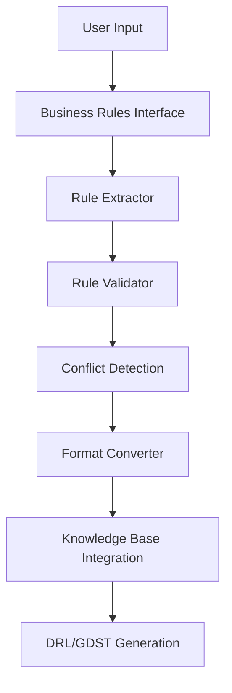
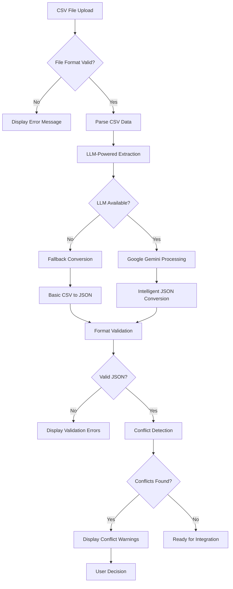

# Business Rules Management System - Deep Dive Documentation

## 📋 Overview

The Business Rules Management System provides comprehensive capabilities for importing, validating, extracting, and managing business rules across multiple industries. The system integrates with Google Gemini LLM for intelligent rule processing and includes robust validation, conflict detection, and format conversion capabilities.

## 🏗️ System Architecture

### High-Level Architecture

The system follows a layered architecture approach:

1. **Frontend Interface Layer** - Gradio-based web interface
2. **Rule Processing Layer** - Extraction, validation, and conversion
3. **Validation Layer** - Conflict detection and rule validation
4. **Storage & Knowledge Base Layer** - Data persistence and RAG integration
5. **LLM Services Layer** - Google Gemini API integration

### Core Components Flow



## 🔄 Business Rule Processing Workflow

### 1. Rule Import & Extraction Flow

**CSV File Processing:**


**Key Features:**
- **Intelligent CSV Parsing** - Context-aware column mapping
- **LLM-Powered Extraction** - Natural language rule interpretation
- **Fallback Mechanisms** - Continues processing if LLM unavailable
- **Comprehensive Validation** - Multi-stage validation pipeline

### 2. Rule Validation Pipeline

**Validation Stages:**

1. **Format Validation**
   ```python
   def validate_rule_format(rule_data: Dict) -> ValidationResult:
       """Validate rule structure and required fields"""
       required_fields = ['rule_id', 'name', 'conditions', 'actions']
       missing_fields = []
       
       for field in required_fields:
           if field not in rule_data:
               missing_fields.append(field)
       
       return ValidationResult(
           is_valid=len(missing_fields) == 0,
           errors=missing_fields,
           warnings=[]
       )
   ```

2. **Semantic Validation**
   ```python
   def validate_rule_semantics(rule_data: Dict, industry: str) -> ValidationResult:
       """Validate rule logic and industry-specific constraints"""
       validator = IndustryValidatorFactory.get_validator(industry)
       return validator.validate_semantics(rule_data)
   ```

3. **Conflict Detection**
   ```python
   def detect_rule_conflicts(new_rule: Dict, existing_rules: List[Dict]) -> List[Conflict]:
       """Detect conflicts with existing rules"""
       conflicts = []
       
       for existing_rule in existing_rules:
           conflict = analyze_rule_overlap(new_rule, existing_rule)
           if conflict.has_conflict:
               conflicts.append(conflict)
       
       return conflicts
   ```

### 3. Multi-Industry Support

**Industry Configurations:**
```python
INDUSTRY_CONFIGS = {
    "restaurant": {
        "specific_fields": ["table_size", "meal_type", "kitchen_capacity"],
        "validation_rules": RestaurantValidationRules,
        "conflict_types": ["menu_overlap", "capacity_conflict", "timing_conflict"]
    },
    "retail": {
        "specific_fields": ["product_category", "inventory_level", "customer_segment"],
        "validation_rules": RetailValidationRules,
        "conflict_types": ["pricing_conflict", "promotion_overlap", "inventory_conflict"]
    },
    "manufacturing": {
        "specific_fields": ["production_line", "quality_threshold", "resource_allocation"],
        "validation_rules": ManufacturingValidationRules,
        "conflict_types": ["resource_conflict", "quality_conflict", "scheduling_conflict"]
    }
}
```

## 🚀 Usage Examples

### CSV Rule Extraction

**Basic Usage:**
```python
from utils.rule_extractor import extract_rules_from_csv

# Simple extraction
rules = extract_rules_from_csv("business_rules.csv")

# Advanced extraction with configuration
from utils.rule_extractor import RuleExtractionConfig

config = RuleExtractionConfig(
    industry="restaurant", 
    request_delay=2.0,
    max_retries=3,
    enable_versioning=True,
    conflict_detection=True
)

rules = extract_rules_from_csv("restaurant_rules.csv", config)
```

**Processing Results:**
```python
# Process extraction results
for rule in rules['extracted_rules']:
    print(f"Rule ID: {rule['rule_id']}")
    print(f"Name: {rule['name']}")
    print(f"Conditions: {rule['conditions']}")
    print(f"Actions: {rule['actions']}")
    
    # Check for conflicts
    if rule.get('conflicts'):
        print(f"Conflicts detected: {len(rule['conflicts'])}")
        for conflict in rule['conflicts']:
            print(f"  - {conflict['type']}: {conflict['description']}")
```

### Rule Validation

**Comprehensive Validation:**
```python
from utils.rule_extractor import validate_rule_conflicts

# Validate against existing rules
validation_result = validate_rule_conflicts(
    new_rules=extracted_rules,
    existing_rules=load_existing_rules(),
    industry_context="restaurant"
)

if validation_result['has_conflicts']:
    print("Conflicts detected:")
    for conflict in validation_result['conflicts']:
        print(f"  - Rule {conflict['rule_id']}: {conflict['description']}")
        print(f"    Severity: {conflict['severity']}")
        print(f"    Recommendation: {conflict['recommendation']}")
```

**Industry-Specific Validation:**
```python
# Restaurant-specific validation
def validate_restaurant_rule(rule_data: Dict) -> ValidationResult:
    """Validate restaurant-specific business logic"""
    errors = []
    warnings = []
    
    # Check for required restaurant fields
    if 'table_size' in rule_data['conditions']:
        table_size = extract_table_size(rule_data['conditions'])
        if table_size > 20:
            warnings.append("Large table sizes may impact kitchen capacity")
    
    # Validate meal type logic
    if 'meal_type' in rule_data['conditions']:
        meal_types = extract_meal_types(rule_data['conditions'])
        invalid_types = [mt for mt in meal_types if mt not in VALID_MEAL_TYPES]
        if invalid_types:
            errors.append(f"Invalid meal types: {invalid_types}")
    
    return ValidationResult(
        is_valid=len(errors) == 0,
        errors=errors,
        warnings=warnings
    )
```

### Format Conversion

**JSON to DRL/GDST Conversion:**
```python
from utils.rule_utils import json_to_drl_gdst

# Convert validated rules to executable formats
for rule in validated_rules:
    try:
        drl_content, gdst_content = json_to_drl_gdst(
            rule,
            industry_context="restaurant",
            update_version_info=True
        )
        
        # Save generated files
        save_drl_file(f"{rule['rule_id']}.drl", drl_content)
        save_gdst_file(f"{rule['rule_id']}.gdst", gdst_content)
        
        print(f"Successfully generated files for rule {rule['rule_id']}")
        
    except Exception as e:
        print(f"Generation failed for rule {rule['rule_id']}: {e}")
```

## 📊 Conflict Detection System

### Conflict Types

**1. Logical Conflicts**
```python
class LogicalConflict:
    """Conflicts in rule logic or conditions"""
    
    def detect_contradictory_conditions(self, rule1: Dict, rule2: Dict) -> Optional[Conflict]:
        """Detect mutually exclusive conditions"""
        # Example: rule1 requires "customer_age >= 18", rule2 requires "customer_age < 18"
        
    def detect_redundant_rules(self, rule1: Dict, rule2: Dict) -> Optional[Conflict]:
        """Detect identical or redundant rule logic"""
```

**2. Business Conflicts**
```python
class BusinessConflict:
    """Business logic and operational conflicts"""
    
    def detect_pricing_conflicts(self, rule1: Dict, rule2: Dict) -> Optional[Conflict]:
        """Detect conflicting pricing rules"""
        
    def detect_resource_conflicts(self, rule1: Dict, rule2: Dict) -> Optional[Conflict]:
        """Detect resource allocation conflicts"""
```

**3. Industry-Specific Conflicts**
```python
class RestaurantConflict:
    """Restaurant industry-specific conflicts"""
    
    def detect_menu_conflicts(self, rule1: Dict, rule2: Dict) -> Optional[Conflict]:
        """Detect conflicting menu item rules"""
        
    def detect_capacity_conflicts(self, rule1: Dict, rule2: Dict) -> Optional[Conflict]:
        """Detect kitchen/seating capacity conflicts"""
```

### Conflict Resolution Strategies

**Automatic Resolution:**
```python
def auto_resolve_conflicts(conflicts: List[Conflict]) -> List[Resolution]:
    """Automatically resolve simple conflicts"""
    resolutions = []
    
    for conflict in conflicts:
        if conflict.type == "redundant_rule":
            # Keep the more recent rule
            resolution = Resolution(
                action="keep_newer",
                rule_to_keep=conflict.newer_rule,
                rule_to_remove=conflict.older_rule,
                confidence=0.9
            )
            resolutions.append(resolution)
        
        elif conflict.type == "minor_condition_overlap":
            # Suggest condition refinement
            resolution = Resolution(
                action="refine_conditions",
                suggested_changes=generate_condition_refinements(conflict),
                confidence=0.7
            )
            resolutions.append(resolution)
    
    return resolutions
```

**Manual Resolution Support:**
```python
def generate_resolution_options(conflict: Conflict) -> List[ResolutionOption]:
    """Generate resolution options for manual review"""
    options = []
    
    if conflict.type == "logical_contradiction":
        options.extend([
            ResolutionOption("modify_rule_1", "Modify conditions in first rule"),
            ResolutionOption("modify_rule_2", "Modify conditions in second rule"),
            ResolutionOption("create_priority", "Create rule priority hierarchy"),
            ResolutionOption("merge_rules", "Merge rules into single comprehensive rule")
        ])
    
    return options
```

## 🔧 Configuration & Customization

### Industry Configuration

**Adding New Industries:**
```python
# config/industry_configs.py
NEW_INDUSTRY_CONFIG = {
    "healthcare": {
        "specific_fields": [
            "patient_category", 
            "treatment_type", 
            "insurance_coverage",
            "medical_necessity"
        ],
        "validation_rules": HealthcareValidationRules,
        "conflict_types": [
            "treatment_protocol_conflict",
            "insurance_eligibility_conflict",
            "medication_interaction",
            "regulatory_compliance_conflict"
        ],
        "required_approvals": ["medical_director", "compliance_officer"],
        "audit_requirements": {
            "retention_period": "7_years",
            "hipaa_compliance": True,
            "reporting_required": True
        }
    }
}

# Register new industry
INDUSTRY_CONFIGS["healthcare"] = NEW_INDUSTRY_CONFIG
```

**Custom Validation Rules:**
```python
class HealthcareValidationRules:
    """Healthcare-specific validation logic"""
    
    def validate_treatment_protocols(self, rule_data: Dict) -> ValidationResult:
        """Validate medical treatment protocols"""
        # Implementation specific to healthcare regulations
        
    def validate_insurance_eligibility(self, rule_data: Dict) -> ValidationResult:
        """Validate insurance coverage rules"""
        # Implementation for insurance validation
        
    def validate_regulatory_compliance(self, rule_data: Dict) -> ValidationResult:
        """Ensure regulatory compliance (HIPAA, FDA, etc.)"""
        # Implementation for regulatory requirements
```

### Custom Rule Processors

**Extending Rule Processing:**  
```python
class CustomRuleProcessor:
    """Custom rule processing logic"""
    
    def __init__(self, industry: str, custom_config: Dict):
        self.industry = industry
        self.config = custom_config
        
    def preprocess_rules(self, rules: List[Dict]) -> List[Dict]:
        """Custom preprocessing logic"""
        processed_rules = []
        
        for rule in rules:
            # Apply custom transformations
            processed_rule = self.apply_industry_transformations(rule)
            processed_rule = self.enrich_with_context(processed_rule)
            processed_rules.append(processed_rule)
        
        return processed_rules
    
    def postprocess_rules(self, rules: List[Dict]) -> List[Dict]:
        """Custom postprocessing logic"""
        # Apply final transformations
        return [self.finalize_rule(rule) for rule in rules]
```

## 🧪 Testing & Quality Assurance

### Validation Testing

**Unit Tests:**
```python
def test_rule_format_validation():
    """Test rule format validation"""
    # Valid rule
    valid_rule = {
        "rule_id": "TEST_001",
        "name": "Test Rule",
        "conditions": ["customer_type == 'VIP'"],
        "actions": ["apply_discount(0.1)"]
    }
    result = validate_rule_format(valid_rule)
    assert result.is_valid
    
    # Invalid rule - missing required field
    invalid_rule = {
        "rule_id": "TEST_002",
        "name": "Incomplete Rule"
        # Missing conditions and actions
    }
    result = validate_rule_format(invalid_rule)
    assert not result.is_valid
    assert "conditions" in result.errors
    assert "actions" in result.errors

def test_conflict_detection():
    """Test conflict detection logic"""
    rule1 = {
        "rule_id": "CONFLICT_001",
        "conditions": ["customer_age >= 18"],
        "actions": ["allow_alcohol_purchase()"]
    }
    
    rule2 = {
        "rule_id": "CONFLICT_002", 
        "conditions": ["customer_age < 21"],
        "actions": ["require_id_verification()"]
    }
    
    conflicts = detect_rule_conflicts(rule1, [rule2])
    assert len(conflicts) > 0
    assert any(c.type == "age_logic_conflict" for c in conflicts)
```

**Integration Tests:**
```python
def test_end_to_end_csv_processing():
    """Test complete CSV to rule conversion flow"""
    # Create test CSV
    test_csv_content = """
    Rule Name,Condition,Action,Priority
    VIP Discount,customer_type == 'VIP',apply_discount(0.15),1
    Bulk Order,quantity > 100,apply_bulk_discount(0.1),2
    """
    
    # Process through complete pipeline
    with temp_csv_file(test_csv_content) as csv_path:
        config = RuleExtractionConfig(
            industry="retail",
            enable_versioning=True,
            conflict_detection=True
        )
        
        result = extract_rules_from_csv(csv_path, config)
        
        # Validate results
        assert result['success']
        assert len(result['extracted_rules']) == 2
        assert all('version_info' in rule for rule in result['extracted_rules'])
        
        # Test rule generation
        for rule in result['extracted_rules']:
            drl_content, gdst_content = json_to_drl_gdst(rule)
            assert drl_content is not None
            assert gdst_content is not None
```

### Performance Testing

**Load Testing:**
```python
def test_large_csv_processing():
    """Test processing of large CSV files"""
    # Generate large test dataset
    large_csv = generate_test_csv(num_rules=1000)
    
    start_time = time.time()
    result = extract_rules_from_csv(large_csv)
    processing_time = time.time() - start_time
    
    # Performance assertions
    assert processing_time < 300  # Should complete within 5 minutes
    assert result['success']
    assert len(result['extracted_rules']) == 1000
    
    # Memory usage validation
    memory_usage = get_memory_usage()
    assert memory_usage < 500_000_000  # Less than 500MB

def test_concurrent_processing():
    """Test concurrent rule processing"""
    import concurrent.futures
    
    csv_files = [f"test_rules_{i}.csv" for i in range(10)]
    
    with concurrent.futures.ThreadPoolExecutor(max_workers=5) as executor:
        futures = [
            executor.submit(extract_rules_from_csv, csv_file)
            for csv_file in csv_files
        ]
        
        results = [future.result() for future in futures]
    
    # All processing should complete successfully
    assert all(result['success'] for result in results)
```

## 📈 Performance Optimization

### Optimization Strategies

**1. Intelligent Caching:**
```python
class RuleProcessingCache:
    """Cache for expensive rule processing operations"""
    
    def __init__(self, max_size: int = 1000):
        self.cache = {}
        self.max_size = max_size
        
    def get_cached_validation(self, rule_hash: str) -> Optional[ValidationResult]:
        """Get cached validation result"""
        return self.cache.get(f"validation_{rule_hash}")
        
    def cache_validation(self, rule_hash: str, result: ValidationResult):
        """Cache validation result"""
        if len(self.cache) >= self.max_size:
            self._evict_oldest()
        self.cache[f"validation_{rule_hash}"] = result
```

**2. Batch Processing:**
```python
def process_rules_in_batches(rules: List[Dict], batch_size: int = 50) -> List[Dict]:
    """Process rules in batches for better performance"""
    processed_rules = []
    
    for i in range(0, len(rules), batch_size):
        batch = rules[i:i + batch_size]
        
        # Process batch
        batch_results = process_rule_batch(batch)
        processed_rules.extend(batch_results)
        
        # Progress reporting
        progress = min((i + batch_size) / len(rules), 1.0)
        report_progress(f"Processing: {progress:.1%}")
    
    return processed_rules
```

**3. Parallel Validation:**
```python
def validate_rules_parallel(rules: List[Dict]) -> List[ValidationResult]:
    """Validate rules in parallel for improved performance"""
    with concurrent.futures.ThreadPoolExecutor() as executor:
        validation_futures = [
            executor.submit(validate_single_rule, rule)
            for rule in rules
        ]
        
        results = [
            future.result() 
            for future in concurrent.futures.as_completed(validation_futures)
        ]
    
    return results
```

## 🔮 Future Enhancements

### Planned Features

**1. Advanced AI Integration:**
- **Rule Suggestion Engine** - AI-powered rule recommendations
- **Natural Language Rule Editing** - Edit rules using natural language
- **Automated Rule Optimization** - AI-driven rule performance optimization

**2. Enhanced Validation:**
- **Simulation-Based Validation** - Test rules against historical data
- **Impact Prediction** - Predict business impact before rule deployment
- **A/B Testing Integration** - Built-in A/B testing for rule changes

**3. Enterprise Features:**
- **Multi-Tenant Support** - Isolated rule environments
- **Advanced Approval Workflows** - Complex approval processes
- **Audit Trail Enhancement** - Comprehensive audit capabilities
- **API Gateway Integration** - Enterprise API management

**4. Industry Expansion:**
- **Additional Industry Templates** - Healthcare, finance, logistics
- **Regulatory Compliance Modules** - Industry-specific compliance
- **Specialized Validation Rules** - Domain-specific validation logic

### Migration & Scaling

**Database Migration:**
```python
# Future database-backed storage
class DatabaseRuleStorage:
    """Database storage for enterprise deployments"""
    
    def __init__(self, connection_string: str):
        self.engine = create_engine(connection_string)
        
    def store_rules(self, rules: List[Dict]) -> bool:
        """Store rules in database with indexing"""
        
    def query_rules(self, filters: Dict) -> List[Dict]:
        """Query rules with advanced filtering"""
        
    def get_rule_analytics(self) -> Dict:
        """Get analytics on rule usage and performance"""
```

This comprehensive business rules management system provides the foundation for robust, scalable rule processing with multi-industry support, advanced validation, and extensible architecture for future enhancements.