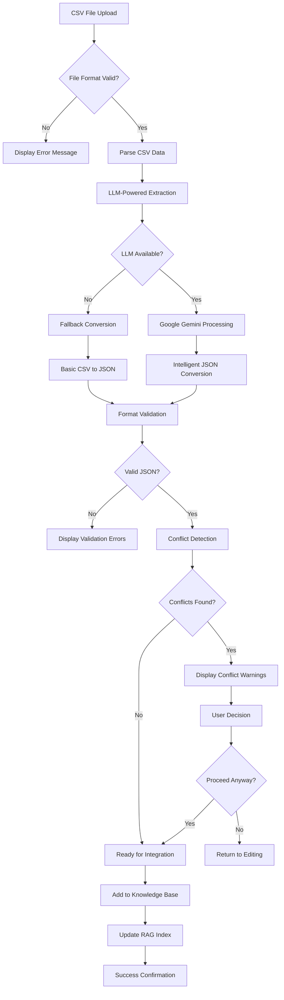
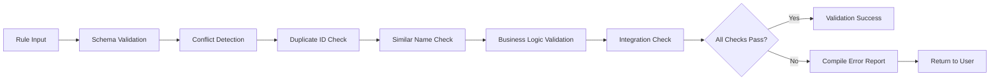
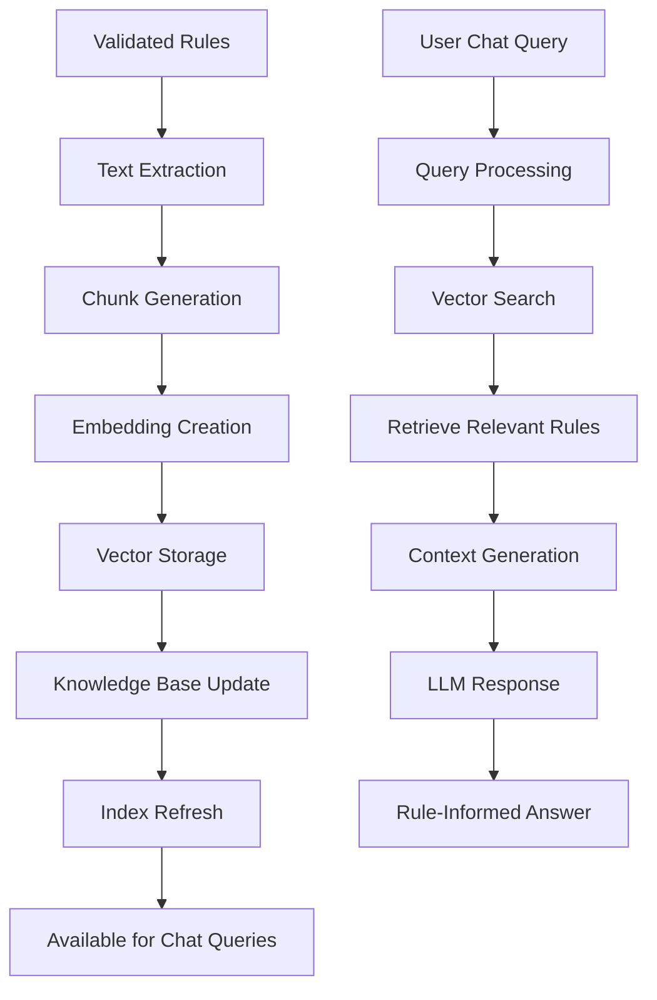
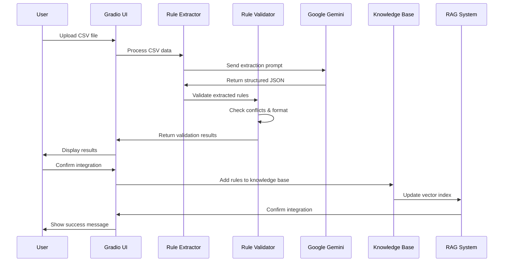

# Business Rule Validation Architecture

## Overview

This document describes the comprehensive architecture for the business rule validation system implemented as part of the RAG-integrated business rule management platform. The system provides end-to-end capabilities for importing, validating, extracting, and managing business rules through multiple interfaces.

## System Architecture

### High-Level Architecture Diagram


## Business Rule Validation Flow

### 1. Rule Import & Extraction Flow



### 2. Rule Validation Pipeline



### 3. RAG Integration Flow



## Component Architecture

### Rule Extractor (`utils/rule_extractor.py`)

**Responsibilities:**
- CSV file parsing and validation
- LLM-powered intelligent extraction
- Fallback conversion mechanisms
- Error handling and logging

**Key Functions:**
```python
extract_rules_from_csv(csv_file_path: str) -> Dict
validate_rule_conflicts(new_rule: Dict, existing_rules: List[Dict]) -> List[str]
save_extracted_rules(rules_json: Dict, output_path: str) -> bool
_basic_csv_to_json_conversion(csv_data: pd.DataFrame) -> Dict
```

### User Interface Integration

**Business Rules Tab Components:**

**Left Panel:**
- File upload component (Gradio File)
- Extract button trigger
- Manual rule input text area
- Validation controls

**Right Panel:**
- JSON display area
- Validation results
- Conflict warnings
- Knowledge base integration status
- Success/error messages

### Data Flow Architecture



## Technical Implementation Details

### File Structure
```
gemini-gradio-poc/
├── utils/
│   ├── rule_extractor.py      # Core rule extraction logic
│   ├── rag_utils.py          # RAG integration utilities
│   └── kb_utils.py           # Knowledge base management
├── interface/
│   └── chat_app.py           # UI with new Business Rules tab
├── data/
│   ├── sample_business_rules.csv  # Sample data
│   └── sample_rules.json     # Target JSON format
├── tests/
│   └── test_rule_extractor.py # Validation tests
└── docs/
    └── BUSINESS_RULE_ARCHITECTURE.md
```

### Key Technologies
- **Frontend**: Gradio for web interface
- **LLM Processing**: Google Gemini via `google.genai`
- **Data Processing**: Pandas for CSV handling
- **Vector Storage**: Scikit-learn for similarity computations
- **Document Processing**: PyPDF2, python-docx for knowledge base

### Error Handling Strategy

1. **Graceful Degradation**: LLM unavailable → Fallback conversion
2. **Validation Layers**: Multiple validation stages with user feedback
3. **Conflict Resolution**: User-guided conflict resolution workflow
4. **Comprehensive Logging**: Detailed error tracking and reporting

## Performance Considerations

### Scalability Features
- **Incremental Processing**: Rules processed individually or in batches
- **Caching**: LLM responses cached for similar rule patterns
- **Vector Optimization**: Efficient similarity search using cosine similarity
- **Memory Management**: Streaming processing for large CSV files

### Monitoring & Metrics
- Rule extraction success rates
- LLM API response times
- Conflict detection accuracy
- User workflow completion rates

## Security & Privacy

### Data Protection
- No persistent storage of sensitive business rules without user consent
- Temporary file handling with automatic cleanup
- API key protection for Google Gemini access

### Access Control
- User-session based rule management
- Isolated processing environments
- Secure file upload validation

## Future Enhancements

### Planned Features
1. **Advanced Conflict Resolution**: ML-powered similarity detection
2. **Rule Versioning**: Git-like version control for business rules
3. **Bulk Operations**: Large-scale rule import/export capabilities
4. **Integration APIs**: REST endpoints for external system integration
5. **Advanced Analytics**: Rule usage and performance analytics

### Architecture Evolution
- Microservices decomposition for scale
- Event-driven architecture for real-time updates
- Multi-tenant support for enterprise deployment
- Advanced caching and performance optimization

---

*Last updated: [Current Date]*
*Version: 1.0*